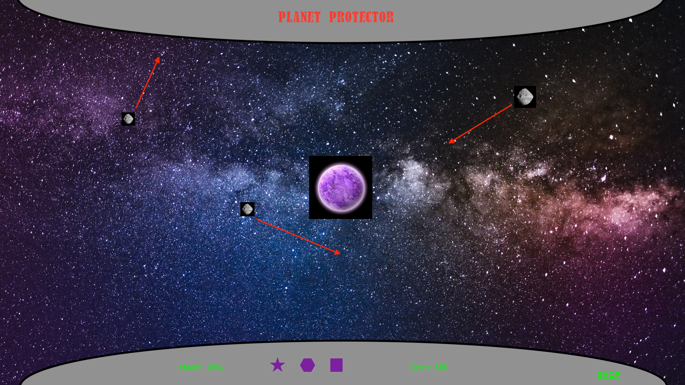

The year is 2121. Most of humanity now lives on planets spread throughout the solar system. Earth was destroyed by an asteroid in 2100 which brings us to your current objective.

Your mission, should you choose to accept it, is to protect planet HTRAE from a similar fate.

You need to blast any astroids away before they touch HTRAE. The planet will take damage depending on the size of the astroid. If the health of HTRAE reaches 0%, the planet will explode.

This job used to be easy but there seems to be an ever increasing number of astroids heading toward the seemingly doomed planet...

Goodluck!

    TECHNICAL OVERVIEW

    3 main elements
    - Clicker
    - Planet
    - Asteroids

    Tools
    - Javascript
    - HTML
    - CSS

    MVP
    - Planet with health property
    - Planet health decreases when asteroid hits it
    - Game over once health reaches 0%
    - Asteroids entering the screen at random and traveling through the screen
    - Ability to remove astroids by clicking on them

    Stretch Goals
    - Have ability to switch between intro, gameplay, shop, and gameover screens
    - Increasing frequency of asteroids
    - Variable speed of asteroids
    - Variable size of asteroids
    - Variable damage caused by asteroids
    - Cash variable
    - Store with ability to purchase upgrades which affect gameplay
    - Multiple objects to fly around along with asteroids
    - Time counter to measure success

    Visuals
    - Planet visual effect to reflect current damage
    - Health bar
    - Visual explosion when clicking asteroid
    - Visual laser on click
    - Rotating planet
    - Moving background for effect
    - Music
    - Read intro audio

    Potential Roadblocks
    - Sizing
    - Object orientation
    - Object value storage

